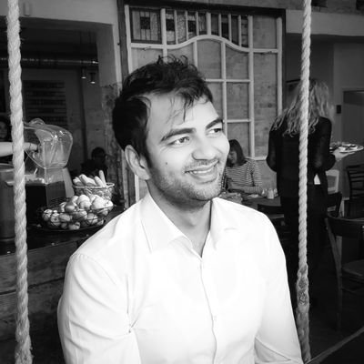

   

  
  
  
  

---

Shreyas is a Machine Learning Engineer, currently exploring predictive models and reinforcement learning at Kopernikus Automotive. 

Open to collaborations: shreyasgite@protonmail.com

## Experience 

#### Autonomous Driving Lead, [Kopernikus Automotive](https://www.kopernikusauto.com)
##### Jun 2017 - Present  | Berlin Area, Germany

I was the 1st employee and worked with founders from building the concept and team to first drive software.
Now a leading a ML team for 
- Level 4 system for one of the biggest car manufacturers.
- Level 4 system for private environments for Porsche.

--- 

#### Visiting Researcher, [FZI Berlin](https://www.fzi.de/wir-ueber-uns/fzi-aussenstelle-berlin/)
##### Nov 2017 - Feb 2018 | Berlin Area, Germany

Worked with extremely smart people on building the understanding of reinforcement learning systems in domain of Robotics.

---

#### Founder Organiser, [Autonomous Mobility Meetup](https://www.meetup.com/autonomous-mobility-berlin/)
##### Dec 2016 - Present | Berlin Area, Germany

Started a community around autonomous mobility to promote coordination and collaboration in Berlin.
The community has now grown to more than 1000 people with regular monthly workshops and robocar races.

---

#### Controls and Test Engineer, [Rolls-Royce Deutschland Ltd & Co KG](https://www.rolls-royce.com/country-sites/deutschland.aspx)
##### Nov 2015 - Feb 2017 | Berlin Area, Germany

I was responsible for 
- writing scripts for testing the prototype jet engines,
- analysing the test data and working with design team on next engine iteration.

---

#### Co-founder, [Ioveda]()
##### June 2015 - Dec 2015 | Berlin Area, Germany

Worked on building a platform for personalised nutritional supplement and had 65 paying customers. 
However we were not able gain enough traction and lacked the experience/will to continue.
In hindsight, feels like we got cold feet and quit too early.

---

#### Machine Learning Lead, [Medlanes](https://medlanes.com)
##### June 2014 - May 2015 | Berlin Area, Germany

I was one of the first five employees and lead the development of a medical expert system.

---

#### Electronics Engineer, [Transocean Offshore Ltd.](https://www.deepwater.com)
##### Oct 2009 - April 2011 | Offshore

Was responsible for installation, calibration and maintenance of the electronics systems on an offshore drilling ship.
Basically the job that Mark Wahlberg did in the movie [Deepwater Horizon.](https://www.youtube.com/watch?v=8yASbM8M2vg)

---

## Education

#### Masters Electrical and IT, [Otto von Guericke University](https://www.uni-magdeburg.de)
##### (2012 - 2014) | Magdeburg, Germany

---

#### Bachelors Instrumentation and Controls Systems, [Pune University](https://www.dypcoeakurdi.ac.in/courses/departments/engineering-colleges-instrumentation-and-control-engineering)
##### (2004 - 2008) | Pune, India 

## Stack

### Languages & Frameworks

- Python
- Pytorch
- Tensorflow
- Keras
- C++

### Platforms

- Google Cloud Platform
- AWS
- Paperspace

### Game Engine

- Unity
- Unreal Engine 4

---

## Quirks

- I've worked on a Drilling Ship and sailed through the eye of hurricane Laila in May 2010. 
- For 20 euros I travelled through Switzerland for 2 weeks, bathing in river, walking almost everywhere, and sleeping in woods.
- Been bitten my a bee, a spider, and a scorpion, and my first travel by plane, helicopter and boat happened on the same day.  
- I've been thrice to 10 day silent meditation practice, swim regularly, and learning to play ukulele with my toddler. 

